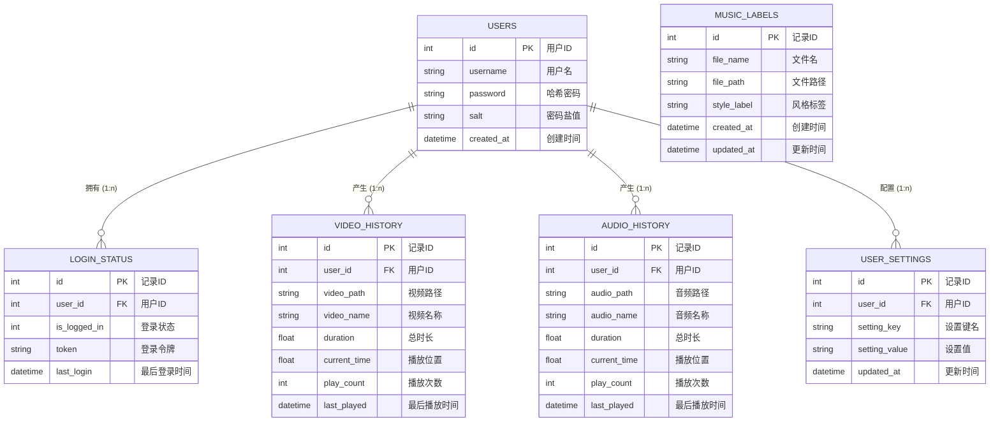
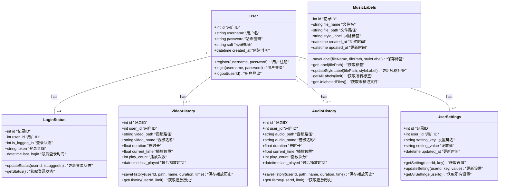

# 媒体播放器数据库设计

本文档详细描述了媒体播放器应用的数据库设计，包括实体关系模型、类图设计以及具体数据表结构。该设计采用SQLite数据库实现轻量级本地存储，使用better-sqlite3作为驱动库，兼顾了性能和便携性，特别适合桌面应用程序的本地数据存储需求。数据库文件根据不同操作系统和运行环境自动选择最佳存储位置，开发环境存储在项目目录，生产环境根据平台特性存储在用户数据目录或应用同级目录。

## 1. 数据库 E-R 图

实体关系图展示了系统中各实体间的关系和基数约束。设计采用以用户为中心的模型，用户实体与其他实体（如登录状态、播放历史和设置）形成一对多的关系。播放历史表设计中，故意允许user_id为空，支持未登录状态下的播放记录保存，实现了灵活的用户体验；同时使用外键约束确保数据完整性，当用户被删除时，相关记录也会级联处理。

## 2. 数据库类图

类图体现了面向对象的设计思想，同时反映了数据访问层的实现方式。采用模块化设计，所有数据库操作通过封装好的函数执行，避免SQL注入风险。密码存储采用PBKDF2-SHA512算法进行哈希处理，使用随机生成的16字节盐值，迭代1000次提升安全性。登录状态管理支持单点登录，通过is_logged_in标志控制登录态，便于多设备同步时的状态管理。

## 3. 数据库表详细设计

数据库设计使用SQLite，设计重点考虑了轻量级、零配置和跨平台支持。表结构采用索引优化，如在播放历史表中对user_id和文件路径添加索引提升查询性能。采用prepared statement机制执行查询，提高安全性和性能。在跨平台实现上，特别处理了Linux下的AppImage环境，确保数据存储路径一致性。

### 3.1 users 表

存储用户基本信息，使用PBKDF2-SHA512算法结合随机盐值对密码进行哈希处理，提供1000次迭代增强安全性。用户名设置UNIQUE约束，防止重复注册。表设计避免存储敏感个人信息，仅保留身份验证必要字段。

| 字段名 | 数据类型 | 约束 | 描述 |
|-------|---------|------|------|
| id | INTEGER | PRIMARY KEY, AUTOINCREMENT | 用户ID |
| username | TEXT | NOT NULL, UNIQUE | 用户名 |
| password | TEXT | NOT NULL | 哈希后的密码 |
| salt | TEXT | NOT NULL | 密码盐值 |
| created_at | TIMESTAMP | DEFAULT CURRENT_TIMESTAMP | 创建时间 |

### 3.2 login_status 表

记录用户的登录状态信息。设计为独立表而非用户表的一个字段，支持多终端登录状态追踪，同时通过与用户表的外键关联确保数据一致性。用户登录时更新为1，登出时更新为0，支持通过last_login字段检测长时间未活动的账户。

| 字段名 | 数据类型 | 约束 | 描述 |
|-------|---------|------|------|
| id | INTEGER | PRIMARY KEY, AUTOINCREMENT | 记录ID |
| user_id | INTEGER | NOT NULL, FOREIGN KEY | 关联用户ID |
| is_logged_in | INTEGER | DEFAULT 0 | 是否已登录(0否,1是) |
| token | TEXT | | 登录token |
| last_login | TIMESTAMP | DEFAULT CURRENT_TIMESTAMP | 最后登录时间 |

### 3.3 video_history 表

记录视频播放历史，采用file_path作为唯一标识而非依赖文件名，以处理同名不同路径的文件。设计支持匿名用户播放记录（user_id可为NULL），方便未登录用户也能享受进度保存功能。对于同一视频的重复播放，通过增加play_count而非创建新记录，减少存储空间占用。

| 字段名 | 数据类型 | 约束 | 描述 |
|-------|---------|------|------|
| id | INTEGER | PRIMARY KEY, AUTOINCREMENT | 记录ID |
| user_id | INTEGER | FOREIGN KEY | 关联用户ID(可为空) |
| video_path | TEXT | NOT NULL | 视频文件路径 |
| video_name | TEXT | NOT NULL | 视频名称 |
| duration | REAL | | 视频总时长 |
| current_time | REAL | DEFAULT 0 | 当前播放位置 |
| play_count | INTEGER | DEFAULT 1 | 播放次数 |
| last_played | TIMESTAMP | DEFAULT CURRENT_TIMESTAMP | 最后播放时间 |

### 3.4 audio_history 表

记录音频播放历史。与视频历史表设计逻辑类似，但单独建表而非合并成一个媒体表，考虑到音频和视频的使用场景和查询模式不同，分表设计提高查询效率，并允许未来针对不同媒体类型的差异化功能扩展。

| 字段名 | 数据类型 | 约束 | 描述 |
|-------|---------|------|------|
| id | INTEGER | PRIMARY KEY, AUTOINCREMENT | 记录ID |
| user_id | INTEGER | FOREIGN KEY | 关联用户ID(可为空) |
| audio_path | TEXT | NOT NULL | 音频文件路径 |
| audio_name | TEXT | NOT NULL | 音频名称 |
| duration | REAL | | 音频总时长 |
| current_time | REAL | DEFAULT 0 | 当前播放位置 |
| play_count | INTEGER | DEFAULT 1 | 播放次数 |
| last_played | TIMESTAMP | DEFAULT CURRENT_TIMESTAMP | 最后播放时间 |

### 3.5 user_settings 表

采用键值对设计存储用户设置，具有高度可扩展性。设置了user_id和setting_key的联合唯一约束，确保每个用户的每个设置项只有一条记录。采用此设计而非固定字段的设计，可以动态添加新的设置项而无需修改数据库结构，提高了系统的灵活性和可维护性。

| 字段名 | 数据类型 | 约束 | 描述 |
|-------|---------|------|------|
| id | INTEGER | PRIMARY KEY, AUTOINCREMENT | 记录ID |
| user_id | INTEGER | NOT NULL, FOREIGN KEY | 关联用户ID |
| setting_key | TEXT | NOT NULL | 设置键名 |
| setting_value | TEXT | | 设置值 |
| updated_at | TIMESTAMP | DEFAULT CURRENT_TIMESTAMP | 更新时间 |

### 3.6 music_labels 表

存储音乐文件标签信息，支持对音乐进行风格分类。设计中file_path设为唯一约束而非主键，并将file_name单独保存，考虑到文件可能会移动位置但名称保持不变的情况。实现机制中对同名不同路径的文件进行了特殊处理，可以智能继承已有同名文件的风格标签，节省用户手动标记的工作量。

| 字段名 | 数据类型 | 约束 | 描述 |
|-------|---------|------|------|
| id | INTEGER | PRIMARY KEY, AUTOINCREMENT | 记录ID |
| file_name | TEXT | NOT NULL | 音乐文件名 |
| file_path | TEXT | NOT NULL, UNIQUE | 音乐文件路径 |
| style_label | TEXT | | 风格标签 |
| created_at | TIMESTAMP | DEFAULT CURRENT_TIMESTAMP | 创建时间 |
| updated_at | TIMESTAMP | DEFAULT CURRENT_TIMESTAMP | 更新时间 |
